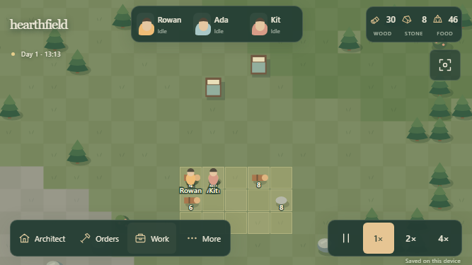

# Hearthfield · Colony Sim

A phone-first browser colony simulation. Three autonomous settlers gather resources, carry supplies, build your plans, eat, and sleep in a procedural 80 × 80 woodland. **Hearthfield is a provisional working title**, not a commitment to the final setting.

The original [GDD](mobile_colony_sim_gdd_v0.1.md) remains authoritative. This implementation focuses on the first playable logistics loop. All visuals are original Canvas shapes and SVG icons. There are no external fonts, art downloads, runtime frameworks, accounts, or services.



## Run locally

Use **Node.js 22.12+** (verified with 22.23.2) and npm.

```sh
npm ci
npm run dev
```

Open **http://localhost:5180**. Vite reports another port if that one is occupied. The debug console API exists only in development builds.

```sh
npm run build           # Strict TypeScript check + production bundle
npm run verify:production # Check dist paths, manifest, icons and service worker after build
npm run preview         # Production build at http://localhost:4180
npm run typecheck
npm test                # Headless simulation / persistence tests
npx playwright install chromium
npm run test:browser    # Builds must be current; starts its own test servers
npm run format:check
npm run format
```

Browser tests use dedicated ports **5187 and 4187**, and refuse to reuse an unrelated running server. `npm run build` is required before browser tests so offline checks exercise the current production output. Screenshots and failure traces go to the ignored `test-results/` directory. Formatting deliberately excludes the original GDD.

## Play on your phone

1. Connect the computer and phone to the same Wi-Fi network.
2. Run `npm run dev` or `npm run build` followed by `npm run preview`.
3. Find the computer's Wi-Fi IPv4 address with `ipconfig`.
4. On the phone, visit `http://<computer-ip>:5180` for development, or port **4180** for the production preview. Use landscape orientation.

The server binds to `0.0.0.0`. Windows may require allowing Node through the firewall on your private network. No firewall settings are changed by this project.

**Installation and offline use require HTTPS or localhost.** Plain HTTP over a LAN is suitable for playing and touch testing, but does not enable the service worker on Android Chrome. To test installation, serve `dist/` through an HTTPS static host, or use Android USB debugging with `adb reverse tcp:4180 tcp:4180` and open `http://localhost:4180` on the phone. Install from the browser menu after the production app has loaded online. The manifest requests landscape and standalone/fullscreen behavior; browser support determines the final presentation.

Saves belong to the **browser profile and origin**, including port. A LAN address, localhost, development port, production port, and hosted domain each have separate saves. Use **More → Export save / Import save** to move a colony between them.

## First few minutes

- The starting colony includes physical food, wood and stone, a small stockpile, two tree orders, and one bed blueprint. Unpause and watch the first construction happen.
- **Orders → Gather resources:** drag a rectangle over trees, berry bushes or stone. A gold cross marks planned work.
- **Architect:** tap for a bed/door, drag a wall line, or drag a stockpile rectangle. Plans require delivered wood before construction begins.
- **Done** exits the tool. One finger pans in inspect mode; two fingers pan and pinch in any mode. Mouse dragging and wheel zoom work on desktop.
- Tap an object for information and context actions. Tap a colonist portrait to select and focus them.
- **Work:** tap a priority to cycle **1 → 2 → 3 → 4 → off**. Skill is shown below. Eating and resting override normal work.
- **Orders → Cancel plans:** remove tree orders, unfinished blueprints, or stockpile cells. Delivered and carried materials are retained. Completed structures can be deconstructed from their context panel.
- Use **pause / 1× / 2× / 4×** freely. Management screens do not automatically pause the colony.
- **Architect → Growing zone:** drag over soil or fertile ground. Colonists with Gather/Plants work enabled sow grain, tend it, harvest mature crops, and create physical raw food.
- **Architect → Cooking station:** place and build one with delivered wood. A cook uses four raw food to make one physical meal; hungry colonists prefer meals and restore more hunger from them.
- Select a completed wall, door, bed, or cooking station and choose **Deconstruct**. A builder works on it and returns 60% of its wood as a physical stack.

Resource totals count items on the ground plus carried items. Delivered construction material is committed to its blueprint and no longer included in those totals. No material is deducted when a blueprint is placed. Leave doorways through walls so colonists can reach food and work.

Desktop shortcuts: **Space** toggles pause; **Escape** closes a panel/tool/selection; **F** focuses the settlement; **D** toggles diagnostics. Buttons remain usable without shortcuts or hover.

## Saving and offline behavior

- Resume the newest valid local save automatically.
- IndexedDB autosave every **15 real seconds**, plus saves after map orders, explicit Save, and visibility/page-hide events.
- Retain the preceding database snapshot and a best-effort synchronous page-hide recovery copy.
- Validate save version, checksum and world data before loading. Job claims are reconstructed from physical state: colonists put down carried stacks and choose fresh jobs. Harvest/construction progress and delivered materials remain.
- If no save can be read safely, show a **paused preview with saving disabled**. Existing data remains intact until you explicitly start a new colony or import a valid save.
- HTTPS/localhost browsers with Web Locks permit only one writing tab. A second tab is a preview until the first is closed and the second reloaded. On insecure LAN origins without that API, use one tab.
- No offline time catch-up. Browser closure, backgrounding and reopening do not fast-forward hunger or construction. Resume starts at 1×.
- Export periodically for a portable backup. Browser data clearing/eviction removes local saves; page termination can prevent a final save. The regular autosave limits ordinary loss to roughly 15 seconds.

The production service worker precaches the complete shell. Updates activate after the old app's tabs close. Development deliberately has no service worker.

## Deploy over HTTPS

The repository includes [`.github/workflows/deploy-pages.yml`](.github/workflows/deploy-pages.yml). It runs the production build and publishes `dist/` to GitHub Pages after every push to `main`, with a manual dispatch option. The app uses relative Vite, manifest, and service-worker paths, so it works at a GitHub Pages project subpath and remains installable from that HTTPS origin.

Repository: [github.com/SNeil-Tas/hearthfield](https://github.com/SNeil-Tas/hearthfield). Live site: [sneil-tas.github.io/hearthfield](https://sneil-tas.github.io/hearthfield/). The `main` branch deploys through GitHub Actions using [`.github/workflows/deploy-pages.yml`](.github/workflows/deploy-pages.yml). Future pushes to `main` update the site automatically; the generated service-worker cache version removes the previous shell after the old app closes. Open the live HTTPS URL on Android Chrome, use **Install app**, and test the installed PWA. Physical Android testing is still pending.

## Development orientation

See [ARCHITECTURE.md](ARCHITECTURE.md), [DECISIONS.md](DECISIONS.md), [IMPLEMENTATION_STATUS.md](IMPLEMENTATION_STATUS.md), and [docs/VERIFICATION.md](docs/VERIFICATION.md).

In development, `window.colonyDebug` exposes the simulation, camera, clock, UI state, `step(count)`, and `save()`. Pause first when stepping manually. **More → Diagnostics** shows job paths, tick, reservation count, entity IDs, positions and selected-target ownership. This debug console API is omitted from production.

The prototype intentionally has no combat, cooking, roof/shelter simulation, farming, death, audio, or cloud saves yet. Hunger/rest, physical logistics, navigation and construction are live systems rather than scripted animations.
