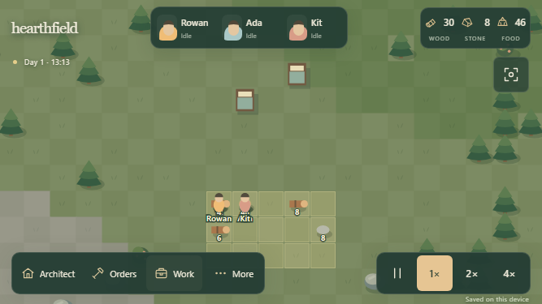

# Hearthfield · Colony Sim

A phone-first browser colony simulation. Fifteen autonomous settlers gather resources, carry supplies, build your plans, eat, and sleep in a procedural 80 × 80 landscape. **Hearthfield is a provisional working title**, not a commitment to the final setting.

The original [GDD](mobile_colony_sim_gdd_v0.1.md) remains authoritative. This implementation focuses on the first playable logistics loop. All visuals are original Canvas shapes and SVG icons. There are no external fonts, art downloads, runtime frameworks, accounts, or services.

In v0.14, Dump zones close the renewable soil-fertility loop. Haulers bring spoiled food and waste to designated tiles; when that waste expires, every full 30 points on a Dump tile becomes one physical fertilizer and any smaller remainder decays. Existing fertilizing work then carries that fertilizer to nutrient-poor growing zones. This reuses the current physical items, expiry cohorts, hauling, and field work without changing the save schema.

In v0.13, every new colony receives one of five deterministic landforms: a river valley, twin lakes, marsh edge, highland creek, or wooded basin. Layered terrain noise varies ridges, soil, fertile ground, woodland, and resource clusters within each family. Generation protects a viable starting clearing, nearby supplies, accessible freshwater, and a mix of brackish habitats. The HUD names the current landscape and the Wildlife screen explains its character.

Rabbits, deer, wild boars, bison, foxes, and wolves form a wilderness ecology. Animals graze regenerating terrain forage, roam, flee, hunt, reproduce, mature, grow old, die, and migrate when a local population becomes too sparse. Hungry adult foxes and wolves can stalk and attack nearby colonists. Colonists automatically strike back when attacked, but their bare-handed damage is very low. Wildlife still does not consume colony food, damage crops, enter work, or block navigation.

Colonists also form directed relationships through periodic encounters while they are near one another. Familiarity and opinion can develop into friendship, close friendship, or rivalry; established bonds contribute a bounded social effect to mood and appear in each colonist's inspector.

Each colonist now has a persistent psychological profile: sociability, resilience, diligence, curiosity, sensitivity, empathy, and a preferred kind of work. Belonging, recreation, privacy, purpose, security, and comfort respond to their surroundings and daily activities. Different personalities weigh those needs differently; sustained strain builds stress, slows work, and takes time to recover from. Colonists can seek company, recreation, or quiet space between jobs, while food, rest, and child care keep priority. Children receive emotional support from nearby adult care.

Meals, sleeping conditions, satisfying work, conversations, injuries, milestones, partnerships, births, and bereavement leave bounded memories that fade instead of accumulating permanent mood modifiers. Tap a colonist and read **Inner life** for their personality, unmet needs, stress, emotional mood contribution, and recent memories. Save version 11 preserves this state and migrates versions 1–10 with deterministic profiles.



## Run locally

Use **Node.js 22.12+** (verified with 22.23.2) and npm.

```sh
npm ci
npm run dev
```

Open **http://localhost:5180**. Vite reports another port if that one is occupied. The debug console API exists only in development builds.

```sh
npm run build           # Strict TypeScript check + production bundle
npm run verify:production # Check dist paths, manifest, icons and service worker after build
npm run preview         # Production build at http://localhost:4180
npm run typecheck
npm test                # Headless simulation / persistence tests
npx playwright install chromium
npm run test:browser    # Builds must be current; starts its own test servers
npm run format:check
npm run format
```

Browser tests use dedicated ports **5187 and 4187**, and refuse to reuse an unrelated running server. `npm run build` is required before browser tests so offline checks exercise the current production output. Screenshots and failure traces go to the ignored `test-results/` directory. Formatting deliberately excludes the original GDD.

## Play on your phone

1. Connect the computer and phone to the same Wi-Fi network.
2. Run `npm run dev` or `npm run build` followed by `npm run preview`.
3. Find the computer's Wi-Fi IPv4 address with `ipconfig`.
4. On the phone, visit `http://<computer-ip>:5180` for development, or port **4180** for the production preview. Use landscape orientation.

The server binds to `0.0.0.0`. Windows may require allowing Node through the firewall on your private network. No firewall settings are changed by this project.

**Installation and offline use require HTTPS or localhost.** Plain HTTP over a LAN is suitable for playing and touch testing, but does not enable the service worker on Android Chrome. To test installation, serve `dist/` through an HTTPS static host, or use Android USB debugging with `adb reverse tcp:4180 tcp:4180` and open `http://localhost:4180` on the phone. Install from the browser menu after the production app has loaded online. The manifest requests landscape and standalone/fullscreen behavior; browser support determines the final presentation.

Saves belong to the **browser profile and origin**, including port. A LAN address, localhost, development port, production port, and hosted domain each have separate saves. Use **More → Export save / Import save** to move a colony between them.

## First few minutes

- The starting colony includes physical food, wood and stone, a small stockpile, two tree orders, and one bed blueprint. Unpause and watch the first construction happen.
- **Orders → Gather resources:** drag a rectangle over trees, berry bushes or stone. A gold cross marks planned work.
- **Architect:** tap for a bed/door, drag a wall line, or drag a stockpile rectangle. Plans require delivered wood before construction begins.
- **Done** exits the tool. One finger pans in inspect mode; two fingers pan and pinch in any mode. Mouse dragging and wheel zoom work on desktop.
- Tap an object for information and context actions. Tap a colonist portrait to select and focus them.
- A selected colonist's Relationships section shows how well they know each settler and their current opinion. Relationships develop autonomously when colonists spend time near one another.
- Tap a wild animal to inspect its species, age, health, energy, current behaviour, and any target it is tracking. **More → Wildlife** summarizes all six populations and warns about predator encounters.
- **Work:** tap a priority to cycle **1 → 2 → 3 → 4 → off**. Skill is shown below. The shared board lists work noticed and posted by busy colonists, including its current claimant. Eating and resting override normal work.
- Adults notice missing household shelter and beds every 30 simulated seconds, including beds for their children. They claim spare indoor beds, add beds to existing rooms, or design and build a home. Both Build skill and Building knowledge determine whether they can design a simple shelter, cottage, or two-room home. Colonists request design help when they cannot plan a home themselves, and post timber, delivery, and building work for others. Personal housing work takes precedence over ordinary work while still respecting disabled work types; food, rest, and childcare come first. The inspector shows housing progress and the Work screen shows Building knowledge.
- **Orders → Cancel plans:** remove tree orders, unfinished blueprints, or stockpile cells. Delivered and carried materials are retained. Completed structures can be deconstructed from their context panel.
- Use **pause / 1× / 2× / 4×** freely. Management screens do not automatically pause the colony.
- Follow the **Next step** card for a gentle settlement arc. Tap it to see the full colony-goal roadmap; goals never expire and completed milestones persist in the save.
- **Architect → Growing zone:** drag over soil or fertile ground. Colonists with Gather/Plants work enabled sow grain, tend it, harvest mature crops, and create physical raw food.
- **Architect → Cooking station:** place and build one with delivered wood. A cook uses 100 raw food points to make one physical meal; hungry colonists prefer meals and restore more hunger from them.
- **Architect → Dump zone:** designate ground for spoiled food and waste. Every 30 waste points that finish decaying on a Dump tile produce one physical fertilizer; a smaller expired remainder simply decays. Colonists already know how to haul the waste and apply the fertilizer to depleted fields.
- Select a completed wall, door, bed, or cooking station and choose **Deconstruct**. A builder works on it and returns 60% of its wood as a physical stack.

Resource totals count items on the ground plus carried items. The player-facing Food total counts fresh raw points and cooked meals, excluding spoiled portions and waste; diagnostics retain raw quantities. Delivered construction material is committed to its blueprint and no longer included in those totals. No material is deducted when a blueprint is placed. Leave doorways through walls so colonists can reach food and work.

Desktop shortcuts: **Space** toggles pause; **Escape** closes a panel/tool/selection; **F** focuses the settlement; **D** toggles diagnostics. Buttons remain usable without shortcuts or hover.

## Saving and offline behavior

Autonomous housing uses save schema 10. Older saves gain Building knowledge from each colonist's existing Build skill and begin with no housing projects. Projects, design progress, assigned beds, and delivered wood survive saves. Up to three households plan at once; children get priority. Cancelling a housing blueprint defers that household's next new plan for one game day while leaving other plans and physical materials in place.

- Resume the newest valid local save automatically.
- IndexedDB autosave every **15 real seconds**, plus saves after map orders, explicit Save, and visibility/page-hide events.
- Retain the preceding database snapshot and a best-effort synchronous page-hide recovery copy.
- Validate save version, checksum and world data before loading. Job claims are reconstructed from physical state: colonists put down carried stacks and choose fresh jobs. Harvest/construction progress and delivered materials remain.
- If no save can be read safely, show a **paused preview with saving disabled**. Existing data remains intact until you explicitly start a new colony or import a valid save.
- HTTPS/localhost browsers with Web Locks permit only one writing tab. A second tab is a preview until the first is closed and the second reloaded. On insecure LAN origins without that API, use one tab.
- No offline time catch-up. Browser closure, backgrounding and reopening do not fast-forward hunger or construction. Resume starts at 1×.
- Export periodically for a portable backup. Browser data clearing/eviction removes local saves; page termination can prevent a final save. The regular autosave limits ordinary loss to roughly 15 seconds.

The production service worker precaches immutable shell assets and uses network-first navigation with offline fallback. When a new worker is waiting, Hearthfield shows a Reload action and activates the new build once, without touching IndexedDB. Development deliberately has no service worker.

## Deploy over HTTPS

The repository includes [`.github/workflows/deploy-pages.yml`](.github/workflows/deploy-pages.yml). It runs the production build and publishes `dist/` to GitHub Pages after every push to `main`, with a manual dispatch option. The app uses relative Vite, manifest, and service-worker paths, so it works at a GitHub Pages project subpath and remains installable from that HTTPS origin. v0.3.0 adds activity friction, solid item clutter, spoilage, weather, illness and bed ownership while preserving the v0.2.1 update flow.

Repository: [github.com/SNeil-Tas/hearthfield](https://github.com/SNeil-Tas/hearthfield). Live site: [sneil-tas.github.io/hearthfield](https://sneil-tas.github.io/hearthfield/). The `main` branch deploys through GitHub Actions using [`.github/workflows/deploy-pages.yml`](.github/workflows/deploy-pages.yml). Future pushes to `main` update the site automatically; the generated service worker identifies the GitHub commit, prompts controlled activation, and removes the previous shell after activation. Open the live HTTPS URL on Android Chrome, use **Install app**, and test the installed PWA. Physical Android testing passed for the previous release; v0.2.1 update delivery still needs the targeted phone check.

## Development orientation

See [ARCHITECTURE.md](ARCHITECTURE.md), [DECISIONS.md](DECISIONS.md), [IMPLEMENTATION_STATUS.md](IMPLEMENTATION_STATUS.md), and [docs/VERIFICATION.md](docs/VERIFICATION.md).

In development, `window.colonyDebug` exposes the simulation, camera, clock, UI state, `step(count)`, and `save()`. Pause first when stepping manually. **More → Diagnostics** shows job paths, tick, reservation count, entity IDs, positions and selected-target ownership. This debug console API is omitted from production.

The prototype intentionally has no drafted combat, weapons, raids, medicine, roof/temperature simulation, audio, or cloud saves yet. Colonists now age, suffer and recover from work or predator injuries, slow down while injured, and can die from starvation, injuries, or old age; replacement colonists are not implemented yet. Predator defence is automatic and deliberately weak while unarmed. Farming, cooking, shelter, physical logistics, navigation, activity metabolism and construction are live systems rather than scripted animations.

### v0.5.3 self-care and traversal

Hungry colonists select reachable, unreserved prepared meals before cooking or waste handling. Personal cooking reserves its output and continues directly into eating. Critical hunger can interrupt ingredient gathering to eat a ready meal, refunding all buffered and carried ingredients. Resources and waste remain physical but can be walked through; walls, water and solid natural nodes still block movement. Save schema remains 5. See [verification and measured results](docs/V0.5.3-VERIFICATION.md).

### v0.5.2 storage throughput

Food remains physical and stack-capped at 100 points. Colonists carry up to 100 food points, 30 spoiled-food points, 12 wood, or 12 stone. Stockpiles merge compatible stacks before creating overflow, idle haul work consolidates partial stacks at low priority, and mature grain yields 50 raw-food points. Cooking consumes 100 fresh points and produces an 80-point meal.

### v0.4 food pressure

Food is measured in points. Raw stacks cap at 100 total points and track fractional fresh/spoiled points separately; more than 10 spoiled points require physical separation into spoiled-food stacks capped at 30. Waste is walkable and doubles spoilage for fresh food in an 8-neighbour ring. Indoor storage slows spoilage, while rain worsens exposed food. Meals use 100 fresh raw points and provide 80 hunger points.

Hungry colonists reserve a cooking station for personal self-care, collect ingredients over multiple trips when necessary, and eat the resulting meal immediately. Cooking skill affects preparation speed, while Cook priority is not required for survival cooking. Save schema 5 migrates older food stacks, preserves fractional points, and adds Dump zones and spoiled-food expiry cohorts. Spoilage above 10 points requires physical separation. As of v0.14, expired waste on Dump tiles yields one physical fertilizer per full 30 points, while sub-threshold remainders decay; this adds no new save schema.

## Diagnostics

Hearthfield v0.5.2 keeps a separate runtime diagnostic trace with a 5,000-event ring buffer. It is intentionally not part of normal colony saves, so save files remain compact; the trace resets when the app restarts or a save is loaded. Events are transition/action based rather than per-tick or per-movement.

Open More → Diagnostics to mark a moment and export a self-contained JSON report. Supported Android browsers/PWA installs use the Web Share API for file sharing; otherwise the report downloads normally. When a colonist is selected, Copy Selected Colonist Debug copies a concise state snapshot to the clipboard.


Families and aging: new colonies begin with 15 adults and 240 food. Compatible adult close friends can become romantic partners. Female/male couples can conceive, with a 45-day pregnancy and a one-year recovery interval after birth. A game year remains 60 days. Life stages are infancy (0–1), early childhood (2–9), pubescence (10–13), post-pubescence (14–17), and adulthood (18+). Children do not work; adults fetch food, provide care, and carry or accompany children into reachable enclosed, roofed rooms. Neglect and exposure reduce child health. The colonist inspector shows care, shelter, family, and pregnancy status. Aging progressively greys hair, changes posture, and reduces work and movement starting at 55. Each colonist stores an aging onset for future life-event influences. Save schema 9 preserves these fields and migrates older saves without adding settlers to existing colonies.
